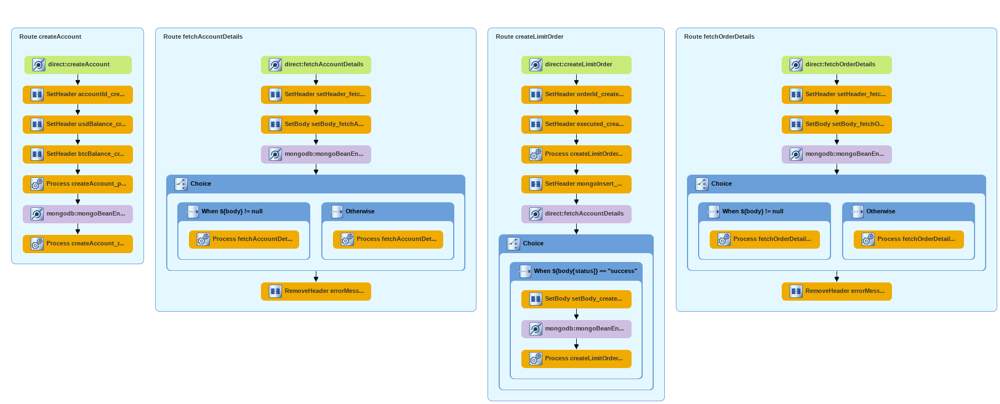
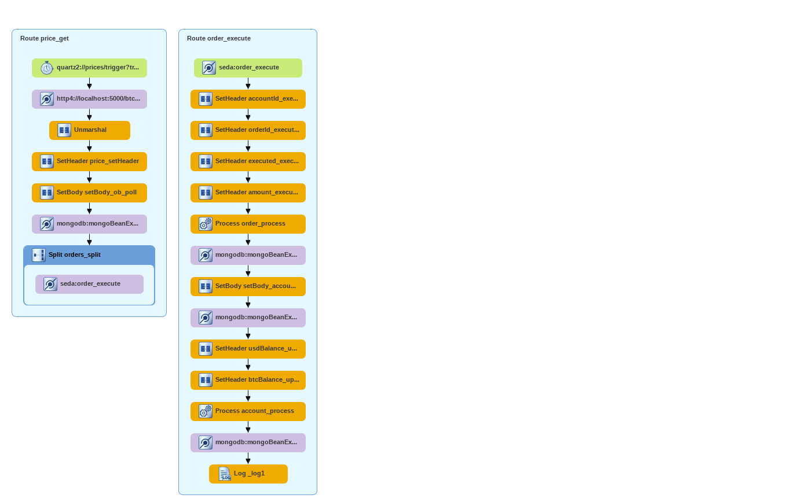

Test project for LOMS 
=========================================
A very simplistic LOMS pilot done using Apache Camel.

Requirements:

- JDK8+
- Maven
- MongoDB listening on localhost:27017
- Price generator on http://localhost:5000/btc-price

To build this project use:

    mvn install

To run the project you can execute the following Maven goal:

    mvn camel:run

Route diagram for loms_entry context:

Route diagram for loms_execution context:

#######################
